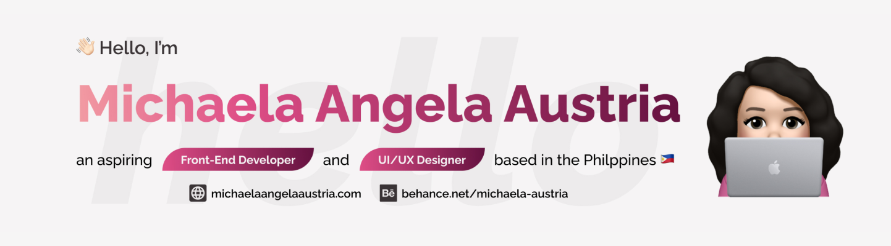

<!--  -->

###

I am a Front-End Developer who is enthusiastic on designing and developing captivating responsive websites and applications. I am constantly learning and improving my technical skills. I started taking courses on Udemy early 2022 and I have been working on variety of passion projects.

###

*   🌍  I'm based in Bulacan, Philippines
*   👩🏻‍🎓  I have a degree Information Technology with specialization in Web and Mobile Application from FEU Institute of Technology.
*   👀  I frequently use `html 5`, `css 3`, `sass`, `javascript`
*   🗂  Visit my [Behance profile](https://www.behance.net/michaela-austria), I document my projects here.
<!-- *   🌱  I am currently studying `Vue JavaScript Framework`
*   🖥️  See my portfolio at [michaelaangelaaustria.com](http://michaelaangelaaustria.com/)
*   ⚡   I recently finished learning [`Complete JavaScript Course`](https://www.udemy.com/certificate/UC-67f744a7-ad3f-4153-bd97-fb7a6369b5b1/) on Udemy and I have a lot of passion projects in mind to apply what I have learned.
*   🏁  The recent project that I have accomplished is [`PupWalk: Dog Walk Tracker`](https://github.com/michaela-austria/pupwalk) where I integrate a map onto the application using Leaflet and Vanilla JavaScript, I built this project with ES6 Classes. -->

###

<!-- <h4 align="left">Skills</h4>

  
  
  
  
  
  
  
  

###

<h4 align="left">Socials</h4>

  
  

###
 -->
<!-- 

  
  

 -->

